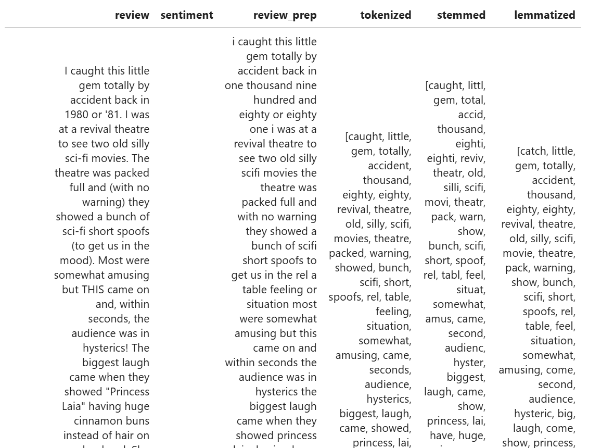
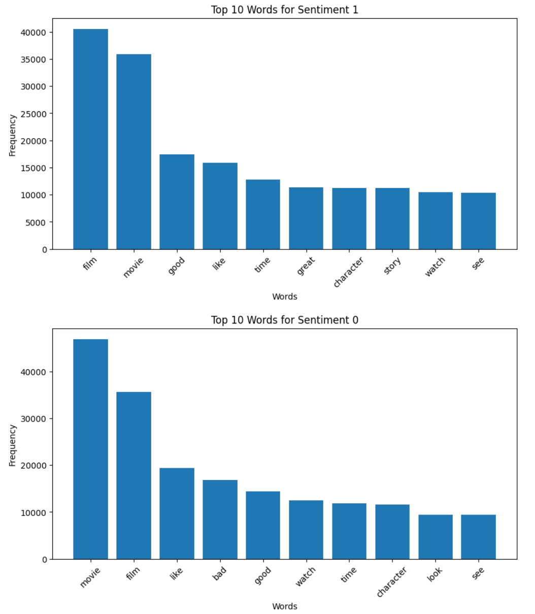
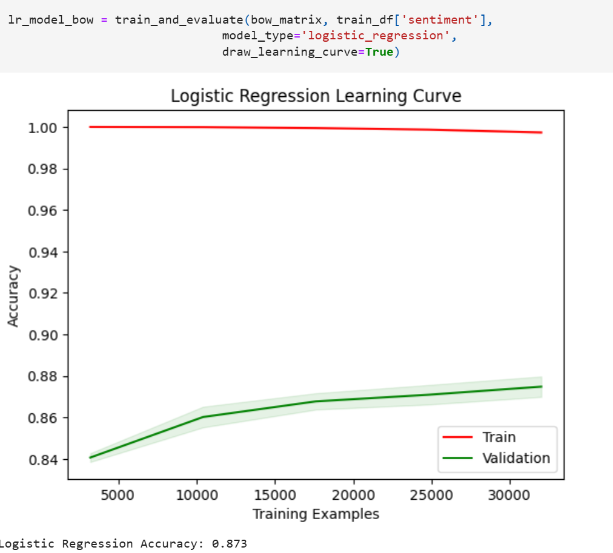
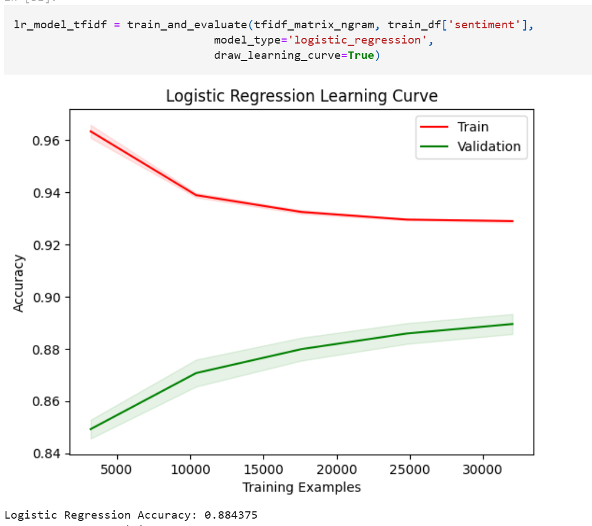
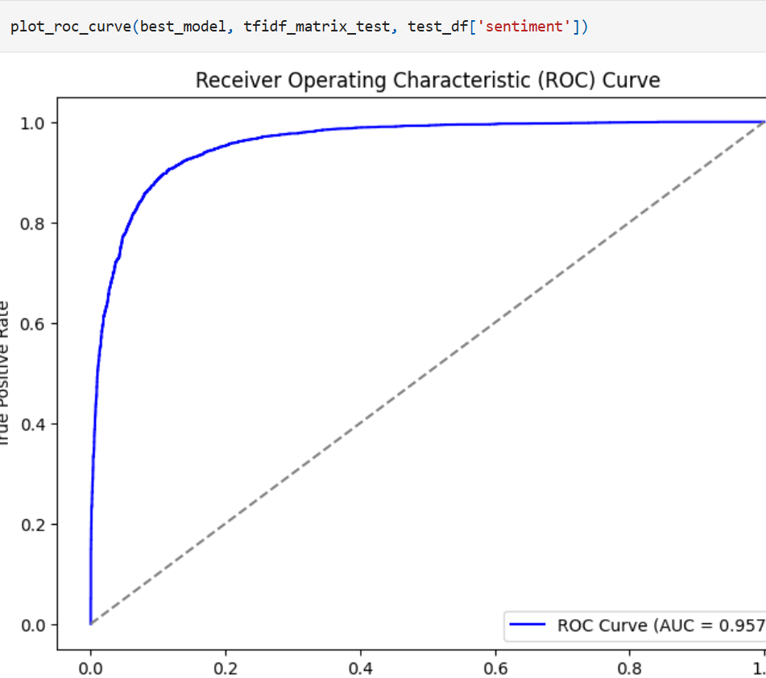

----------

# Movie Review Sentiment Analysis

## 1. Project Overview

This project focuses on **binary classification** of movie reviews (positive/negative) using a dataset of 50,000 reviews.

1.  **Data Science part**: Data exploration, text preprocessing, experimentation with different vectorization/stemming/lemmatization, model training, and selection.
2.  **MLE part**: Structuring the code in a GitHub repo , using Docker containers for reproducible training and inference.

----------

## 2. Data Science Part

All the insights gathered from the experiment's notebook can be found in the notebooks folder. I tried different methods and instantly viewed the results. There, you can also find more detailed conclusions. Before reading the README.md, I highly suggest taking a quick look at the notebook. It’s short and won’t take much time.

### 2.1 EDA (Exploratory Data Analysis)

> **Direct quotes from the notebook**:
> 
> ```
> Number of empty values in test_df: 0
> Number of empty values in train_df: 0
> Positive values in test_df: 5000
> Negative values in test_df: 5000
> Positive values in train_df: 20000
> Negative values in train_df: 20000
> 
> ```

-   **No Missing Data**: The above checks confirm both `train.csv` and `test.csv` have zero NaNs.
-   **Balanced Classes**: Exactly 50% positive and 50% negative labels in both train and test.
-   **Text Length**: Histogram analysis shows review length doesn't cleanly separate positive vs. negative.

> **Notebook quote**:  
> “As you can see, the distributions of different sentiments look similar, so we cannot consider it an important feature.”


----------

### 2.2 Preprocessing & Feature Engineering

EDA part  
tokenization, stop words filtering, compared stemming vs lemmatization, vectorization: compared tf-idf vs bag of words;

> **Notebook quote**:  
> “The data is filled with stopwords and grammatical words that do not carry sentiment or meaning.”

**Key steps**:

1.  **Slang Conversion**: “lol” → “laughing out loud”, “omg” → “oh my god”, etc.
2.  **Remove HTML/URLs/Punctuation**:

```python
def remove_html_tags(text):
    return re.sub(r'<[^>]+>', '', text)

```

3.  **Numbers to Text** using `num2words`.
4.  **Lowercasing + Compound Splitting** with `wordninja`.
5.  **Tokenization** with spaCy’s multi-threaded pipeline:

```python
docs = list(nlp.pipe(texts, batch_size=batch_size, n_process=n_threads))

```

also we removed the stopwords with embedded pre-trained spaCy tokenizer  
6. **Stemming vs. Lemmatization**:

-   **Porter Stemmer** vs. **spaCy Lemmatizer**
-   Lemmatization retained better linguistic meaning.
-   This is a well-known trade-off between speed and accuracy. Lemmatization preserves meaning but is computationally intensive, while stemming is a simpler, faster cutting approach. If we look at a side-by-side comparison of lemmatized vs. stemmed words, we can understand why lemmatization is better.



after the tokenization fast look the top words by sentiment  


----------

### 2.3 Vectorization

> **Notebook quote**:
> 
> ```
> tfidf_vectorizer = TfidfVectorizer(
>     tokenizer=identity_tokenizer,
>     preprocessor=None,
>     token_pattern=None,
>     lowercase=False,
>     max_features=20000,
>     ngram_range=(1,3),
>     min_df=3,
>     max_df=0.90
> )
> 
> ```

-   **Bag of Words (CountVectorizer)** vs. **TF-IDF**.
-   TF-IDF performed better (higher test accuracy, less overfitting).
-   For the vectorization part, I compared the two most well-known methods with n-grams implemented. Before the experiments, I assumed TF-IDF would perform better, but I was surprised by how much Bag-of-Words overfitted. This is because TF-IDF considers word and order by importance and selects only the most relevant ones, while Bag-of-Words treats all words equally and keep the all. The reason Bag-of-Words overfits more is its lack of generalization. In the experiments, this difference is clearly visible through validation and test set accuracy, as well as the learning curves.





----------

### 2.4 Modeling & Results

Tested 3 primary models:

1.  **Logistic Regression**
2.  **Linear SVC**
3.  **Simple Neural Network** (Keras)

I defined baseline models and experimented with parameters. The simple neural network struggled with high-dimensional features, leading to overfitting, but provided insights into model behavior. I used Logistic Regression, LinearSVC, and a custom neural network for comparison, applying regularization to prevent overfitting. This phase remains experimental.

> **Notebook quote**:  
> “Logistic Regression Accuracy: 0.884375” (on validation split with TF-IDF)  
> “Linear SVC Accuracy: 0.886125” (similarly high)  
> “Neural Network Test Accuracy: 0.8824”

I will test different model-vectorizer combinations. BoW causes significant overfitting, but further evaluation is needed. Final validation will be done on the test set.  
After final evaluation on the **unseen test set**:

Here, we will compare all models again using the test dataset, and I will use the TF-IDF vectorizer for evaluation.

| Model               | Vectorization | Accuracy |
|---------------------|--------------|----------|
| Logistic Regression | BoW          | 0.8529   |
| Logistic Regression | TF-IDF       | 0.8905   |
| Neural Network      | TF-IDF       | 0.8879   |
| LinearSVC          | BoW          | 0.8376   |
| LinearSVC          | TF-IDF       | 0.8926   |

Now, all models produced similar results with TF-IDF, while BoW failed again in a more interpretable way. The models performed similarly because they effectively handled 50K sentiment analysis samples with only two classes.

I prefer Logistic Regression since Neural Networks are more computationally intensive while yielding similar results. LinearSVC and Logistic Regression performed similarly, but LinearSVC cannot produce probability-based outputs. Considering interpretability, computational efficiency, and simplicity, the best model for binary classification is Logistic Regression.

Now, our main model is Logistic Regression. Here, we will perform hyperparameter tuning and determine the deployment parameters for our model.

Fitting 5 folds for each of 36 candidates, totalling 180 fits

```
evaluate_model(best_model, tfidf_matrix_test, test_df['sentiment'])
Accuracy: 0.8929

```

roc auc curve graph on test data


> **Notebook metrics**:
> 
> ```
> Accuracy: 0.8929
> precision    recall  f1-score   support
> 
> 0       0.91      0.88      0.89      5000
> 1       0.88      0.91      0.89      5000
> 
>     accuracy                           0.89     10000
> 
> ```

-   **Chosen Model**: Logistic Regression + TF-IDF
-   **Test Accuracy** ~ **0.893**

**Hyperparameter Tuning (GridSearchCV)**:

```python
Best Parameters: {'C': 1, 'max_iter': 200, 'penalty': 'l2', 'solver': 'liblinear'}
Test Accuracy: 0.89125

```

----------

### 2.5 Potential Business Value

**Potential Business Applications and Value for Business**

-   **Movie Studios and Production Houses**:  
    Sentiment analysis helps studios fine-tune their marketing plans based on audience reactions. It also minimizes financial risks by enabling data-driven decisions on content creation.
    
-   **Streaming Platforms (Netflix, Amazon Prime, Disney+)**:  
    Platforms can use sentiment insights to offer personalized content recommendations, enhancing user experience. Additionally, it helps them identify trending content, allowing for better investment in licensing and original productions.
    
-   **Movie Review Aggregators (IMDb, Rotten Tomatoes, Metacritic)**:  
    Automated sentiment analysis summarizes reviews, making it easier for users to grasp overall opinions. This reduces information overload and increases engagement by providing real-time insights.
    
-   **Cinema Chains and Theaters**:  
    Theaters can utilize sentiment data to implement dynamic pricing, adjusting ticket prices based on predicted demand for specific movies.
    
-   **Investors and Financial Analysts**:  
    Sentiment analysis helps predict entertainment company stock performance by assessing audience reactions. It also aids investors in spotting industry trends and potential profitable opportunities.


## 3. MLE Part

To use this repository, first, clone it to your local environment. You only need Docker installed—no need to manage libraries or dependencies. The provided Docker files handle everything.

```bash
git clone https://github.com/mtech00/Epam_NLP_Final.git

```

### 3.1 Repo Structure

```
/data-science-task/
|-- data/             # (git-ignored: raw data)
|   |-- raw/
|-- notebooks/
|-- src/
|   |-- train/
|   |   |-- train.py
|   |   |-- Dockerfile
|   |-- inference/
|   |   |-- run_inference.py
|   |   |-- Dockerfile
|   |-- data_loader.py
|-- outputs/          # (git-ignored: models, predictions)
|   |-- models/
|   |-- predictions/
|-- README.md
|-- requirements.txt
|-- .gitignore

```

### 3.2 Key Scripts

1.  **`data_loader.py`**: Loads raw CSVs into `data/raw/`.
2.  **`train.py`**:
    -   Reads **train.csv**, runs preprocessing, vectorization,tokenization and trains the **Logistic Regression** model.
    -   Saves the trained model in `outputs/models/` and vectorization model `.
3.  **`run_inference.py`**:
    -   Loads **test.csv** (or user data) + the saved model and vectorizer ; outputs predictions + metrics.txt in `outputs/predictions/`.

### 3.3 Docker Usage
After cloning, navigate to the project directory and build the Docker container:
After cloning, navigate to the project directory and build the Docker container:

```bash
cd Epam_NLP_Final
```
First, load the data using the data loader script:

```bash
python src/data_loader.py
```

It requires standart Python libraries

1.  **Train**
    
    ```bash
    docker build -f src/train/Dockerfile -t train_image . #this will build for training image 
    ```
    ```bash
    docker run -v "$PWD/data:/app/data" -v "$PWD/outputs:/app/outputs" train_image #this will build for training image with relative paths you dont need to change the codes folder etc.
    ```
    -   This auto-runs **`train.py`** inside the container, saves model & vectorizer to `/app/outputs`.
    - also gives infos about training and times exported folder
     


```bash
Datasets loaded successfully.
Processing started.
Processing completed successfully.
TF-IDF Vectorization started.
TF-IDF Vectorization completed successfully.
Training started.
Validation Accuracy: 0.888875
              precision    recall  f1-score   support

    negative       0.90      0.87      0.89      3984
    positive       0.88      0.91      0.89      4016

    accuracy                           0.89      8000
   macro avg       0.89      0.89      0.89      8000
weighted avg       0.89      0.89      0.89      8000

Training completed successfully.
Model saved at: outputs/models/logistic_regression_model.pkl
Vectorizer saved at: outputs/models/tfidf_vectorizer.pkl
Execution Time: 147.86 seconds

```
    
2.  **Inference**
    

```bash
# Build the inference Docker image
docker build -f src/inference/Dockerfile -t inference_image .

# Run the inference image
docker run -v "$PWD/data:/app/data" -v "$PWD/outputs:/app/outputs" inference_image

```

This process will:

-   Load the exported model and vectorizer from training
-   Process the test dataset
-   Make predictions
-   Generate a classification report
-   Save `predictions.csv` and dump metrics to `metrics.txt`

### Sample Output:

```bash
Datasets loaded successfully.
Processing started.
Processing completed successfully.
Vectorizing test data.
Vectorization completed successfully.
Test Accuracy: 0.8922
Classification Report:
               precision    recall  f1-score   support

    negative       0.90      0.88      0.89      5000
    positive       0.88      0.91      0.89      5000

    accuracy                           0.89     10000
   macro avg       0.89      0.89      0.89     10000
weighted avg       0.89      0.89      0.89     10000

Predictions saved at: outputs/predictions/predictions.csv
Metrics saved at: outputs/predictions/metrics.txt
Execution Time: 31.58 seconds

```
    
----------


----------

## 5. Final Notes

-   **Accuracy**: ~0.893 (logistic regression + TF-IDF) on test data.
-   **Project**: Demonstrates EDA, thorough preprocessing, multiple model comparisons, and containerized reproducibility

----------
